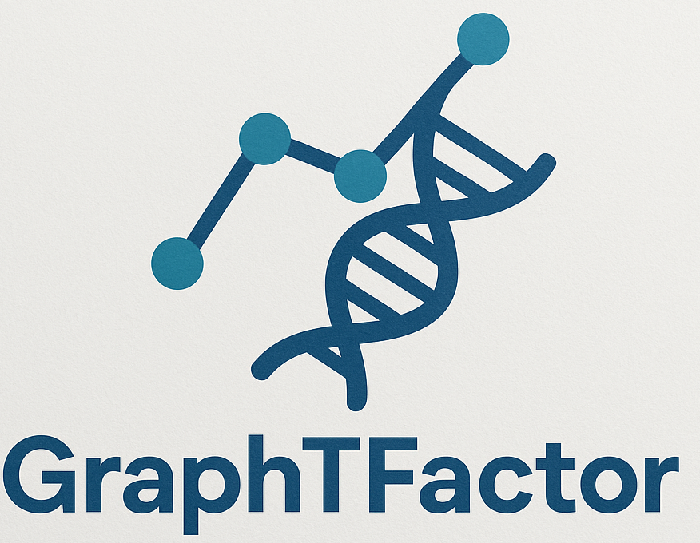

# GraphTFactor
GraphTFactor: a graph-based deep learning tool for protein transcription factor prediction.

---

## Try the Streamlit App

👉 [Access GraphTFactor here]()

---

## Description

GraphTFactor leverages graph neural networks to analyze protein sequences by modeling them as graphs based on their k-mer structures.
This approach enables improved classification of transcription factors, supporting bioinformatics research with accurate and interpretable protein function prediction.

---

## Citation

If you use GraphTFactor in your research, please cite the following paper:

> Amato, D., Calderaro, S., Lo Bosco, G., Vella, F., & Rizzo, R. (2025). Proteins Transcription Factor Prediction Using Graph Neural Networks. In International Meeting on Computational Intelligence Methods for Bioinformatics and Biostatistics (pp. 15-27). Springer, Cham.
> [DOI link](https://link.springer.com/chapter/10.1007/978-3-031-89704-7_2)

---

## Contact

For questions or collaborations, contact: [salvatore.calderaro01@unipa.it](mailto:salvatore.calderaro01@unipa.it)